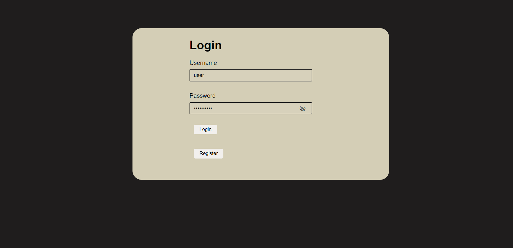
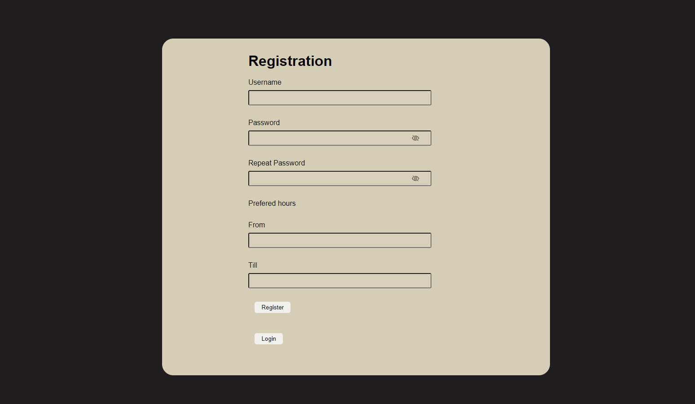
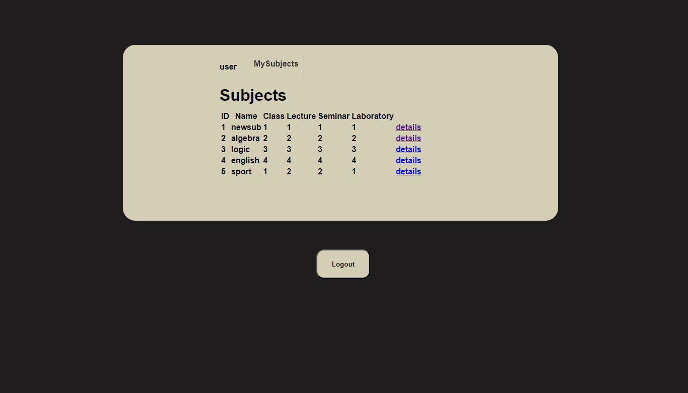

##   MySQL create Connection 
		Database: timetable
		Port:	3306
		Username: root
		Password: password

##	Tables: subjects
		students
		files
		registration	
		users:		INSERT INTO timetable.users values ('user', '5a1729184586c612189ddde9f223b3363beb07e51cdc61b868be3e984e8b729c', 'admin');	
		-> password: 12345 hashelve---> 5a1729184586c612189ddde9f223b3363beb07e51cdc61b868be3e984e8b729c

## 	run: 
    node .\app.js 

##  	Description
    http://localhost:8080/login			-> existing user login
	http://localhost:8080/ 			 	-> main page with all subjects
							-> clicking on the IDs of subjects will show their files(downloadable)
							-> clicking on a description link will redirect you here:
	http://localhost:8080/subID	      guest/user-> details and files(downloadable) for the specific subject
						admin	-> can add and delete files 
	http://localhost:8080/registration		-> students join/leave
	[Change subject]
	http://localhost:8080/addsubj		admin	-> creates a new subject
	[Add subject]

## Restrictions
	Guest:	can view all subjects and their details, files
	User:   can view all subjects and their details, files
		can join/leave a subject
	Admin:	can view all subjects and their details
		can add/delete files if he's the owner
		can set if a student joins/leaves a subject
		can create new subjects
	
##Preview

	
